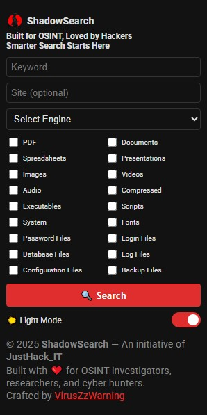

# 🕵️‍♂️ ShadowSearch - Smarter Searching for Smarter Investigations

**ShadowSearch** is a smart search query builder extension designed for OSINT researchers, cybersecurity professionals, ethical hackers, and digital investigators. It streamlines the process of crafting advanced dorking queries to uncover publicly accessible files, media, and sensitive documents across the web.

<p align="center">
  
</p>

---

## 🔍 Features

- ✅ Advanced search query builder
- 🎯 File-type filters (PDFs, documents, images, audio, executables, configs, etc.)
- 🌐 Supports multiple search engines (Google, Bing, Yandex, DuckDuckGo, etc.)
- 🌙 Dark mode toggle with persistent settings
- ⚡ Smart auto-generation for Google Dork queries
- 🧠 Built for hackers, researchers, and analysts

---

## 🔧 How It Works

1. Select file types or target data (e.g., `.pdf`, `.log`, `.sql`)
2. Choose a search engine (Google, Bing, etc.)
3. Input your keywords (site/domain or intext/search parameters)
4. Let ShadowSearch build powerful OSINT queries

---

## 🛠️ Installation

1. Clone this repository or download the ZIP
2. Navigate to `chrome://extensions/` in your browser
3. Enable **Developer Mode**
4. Click **Load unpacked** and select the extension folder

---

## 📸 Screenshot

<p align="center">
  
</p>


---

## 📂 File Types Supported

- Images, Videos, Audio, PDFs
- Documents (Word, Excel, PPT, TXT, etc.)
- Archives (ZIP, RAR, TAR, 7z)
- Executables & Installers (EXE, APK, MSI)
- Scripts (JS, PY, PHP, C, CPP, etc.)
- Databases (SQL, DB, MDB)
- Configs, Logs, Passwords, Backups

---

## 🛡️ Permissions

This extension uses the following permissions:

```
"host_permissions": ["<all_urls>"]
This allows the extension to open crafted search queries in new tabs. No private user data is accessed, stored, or transmitted.
```

## 🧠 About
"Smarter Searching for Smarter Investigations"<br>
🔗 ShadowSearch is an initiative by JustHack_IT to support the infosec and OSINT community.

---

## 📣 Connect & Contribute

👤 Developer: VirusZzWarning

<b>ShadowSearch</b> is licensed under the [MIT License](LICENSE). 

💬 Issues & Suggestions: Open a GitHub issue

🤝 Contributions welcome!

## 🌐 Socials

Connect with me:
- Twitter: [@hrisikesh_pal](https://twitter.com/hrisikesh_pal)
- Instagram: [viruszzwarning](https://www.instagram.com/viruszzwarning)
- YouTube: [JustHack_IT](https://www.youtube.com/@JustHack_IT)
- Discord: [JustHack_IT](https://discord.com/invite/PUzR6YhXgR)

> Copyright © 2025, VirusZzWarning | An initiative of JustHack_IT
